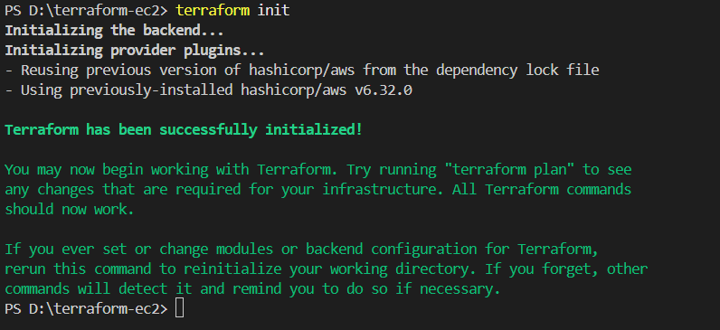
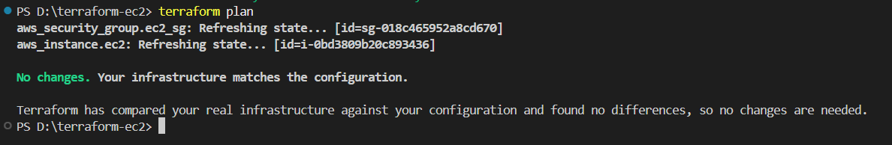
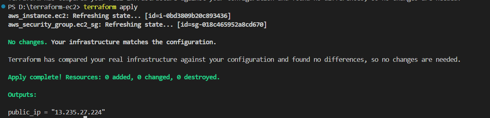
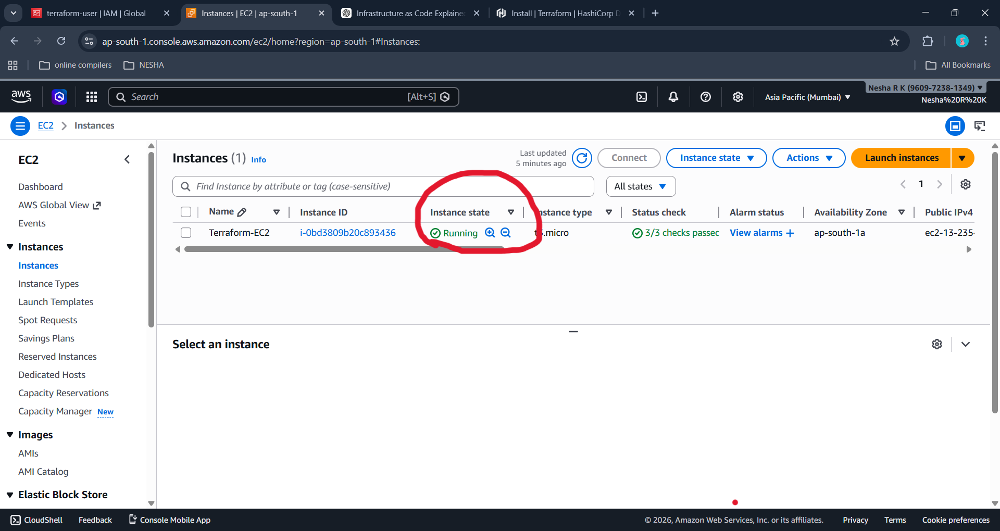
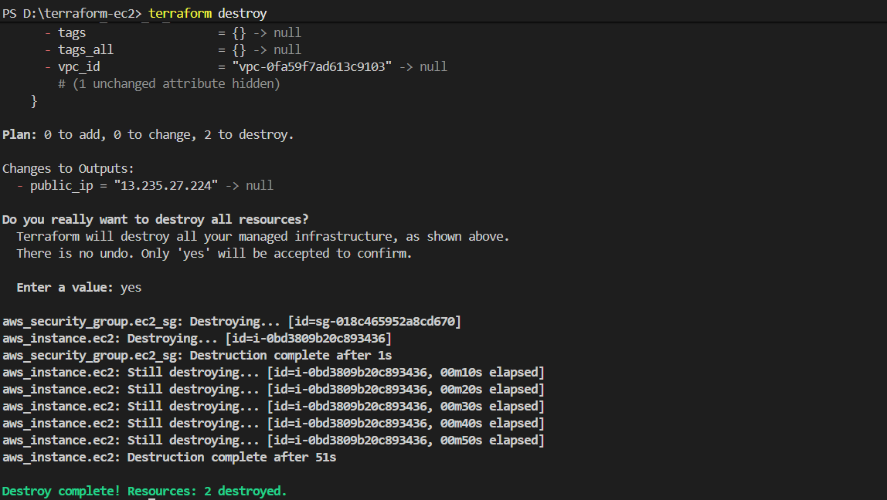
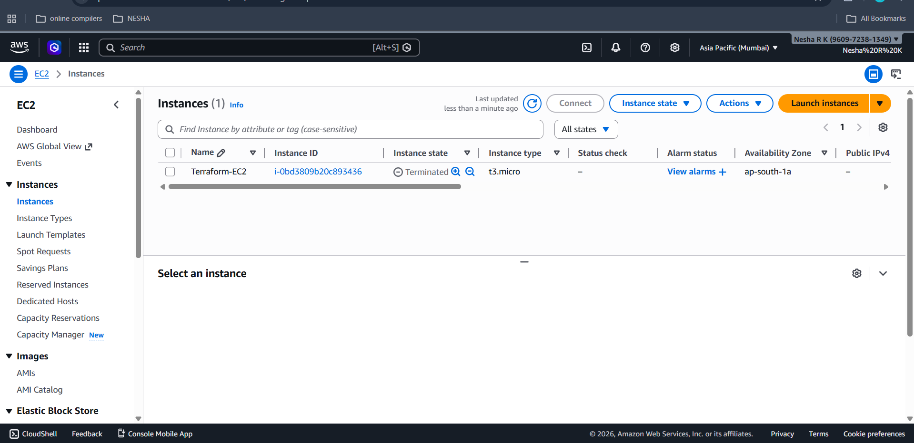

# Terraform AWS EC2 Project 🚀

This project demonstrates provisioning an AWS EC2 instance using **Terraform (Infrastructure as Code)** without manually creating resources in the AWS Management Console.  
It was built as a hands-on learning project to understand Terraform workflows, AWS integration, and DevOps best practices.

---

## 🧰 Tech Stack
- Terraform
- AWS EC2
- AWS CLI
- Git & GitHub
- VS Code
- Windows (PowerShell)

---

## 🎯 Project Objectives
- Provision AWS EC2 using Terraform
- Implement Infrastructure as Code (IaC)
- Avoid manual AWS Console setup
- Handle real-world AWS & Terraform errors
- Follow Git and security best practices

---

## ⚙️ Terraform Workflow
```bash
terraform init
terraform plan
terraform apply
terraform destroy
```
## Terraform init:


## Terraform plan:


## Terraform apply:


## AWS Instance created via VS Code:


## Terraform destroy:


## AWS screenshot after terraform destroy

